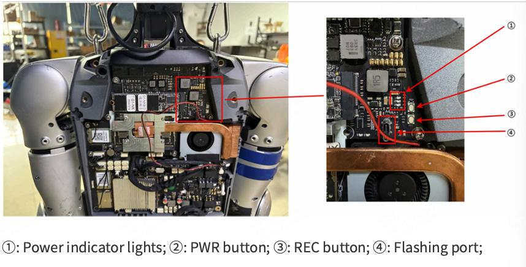

# Unitree G1 JetPack

One script to **build, back up, restore, and flash** a custom NVIDIA **JetPack** image for
the **Unitree G1 custom carrier** (Jetson Orin NX) — multiple JetPack versions from one branch.

## Supported JetPacks

[](versions/7.2/)
[](versions/6.2.2/)
[](versions/5.1.6/)

Pick one with `-j <ver>` — **required for `init` / `flash`** (no default). All three ✅ tested
(WiFi · BT · static IP); `backup` / `restore` / `status` don't need a version. Each badge
links to its `versions/<ver>/`.

Stock JetPack doesn't run cleanly on the G1's custom carrier — the USB3 lanes are wired
differently (so recovery RNDIS and the USB host ports don't work out of the box), and the
onboard WiFi/BT needs an out-of-tree driver. This repo wraps NVIDIA's BSP with those carrier
fixes plus a few rootfs tweaks, so a single `-j <ver> flash` gives you a working board.

> Everything is flashed **in place over the USB-C cable** — no need to remove the NVMe
> SSD from the robot. QSPI and the NVMe rootfs are written over the recovery initrd.

Each image applies a few carrier patches to the **device tree** (USB3 wiring, MB2 boot) and
the **rootfs** (login user, static IP, WiFi/BT). The exact, named set lives in
`versions/<ver>/patches/` — see [Patches](#patches--every-change-in-one-place).

## Requirements

- An **x86_64 Ubuntu host** with `sudo` (the build/flash tooling is NVIDIA's; the rootfs
  steps run aarch64 under `qemu-user-static`, installed automatically if missing).
- The board's USB-C **flashing** port connected to the host. For `flash` / `backup` /
  `restore`, put the board in **recovery (RCM)** mode.

## Quick start

```bash
# choose the JetPack with -j (required for flash). Example: 5.1.6
JP=5.1.6

# board in RECOVERY (RCM) with the USB-C flashing cable connected:
./g1_custom_jetpack.sh status            # confirm APX (bootROM recovery)
./g1_custom_jetpack.sh -j $JP flash all  # full flash (QSPI + NVMe rootfs)
```

`flash` (and `backup` / `restore`) **auto-build the BSP** for the chosen version if
it isn't built yet — no separate `init` step needed. Run `init` on its own only when
you want to (re)build the BSP without flashing.

After it boots: user **`unitree` / `123`**, hostname **`ubuntu`**, wired IP
**`192.168.123.164`** (on `eth0`), WiFi + BT up.

> `-j` can also be given as the `G1_JP` environment variable
> (e.g. `G1_JP=5.1.6 ./g1_custom_jetpack.sh init`).

## Recovery mode (RCM)

`flash`, `backup`, and `restore` need the NX module in **bootROM recovery (APX)**.
The PWR/REC buttons and the flashing port are on the NX board inside the G1's chest:



> ① power indicator lights ② PWR button ③ REC button ④ flashing port

1. Power on the G1; wait until **all three power LEDs are steadily lit**.
2. Press and **hold PWR + REC together for ~2 s** — the LEDs go from three steady
   lights to two light (or all off).
3. Release **PWR**.
4. Wait ~2 s.
5. Release **REC**.

Connect the **USB-A → USB-C** cable from the host to the **flashing port** (④), then
confirm:

```bash
./g1_custom_jetpack.sh status     # -> APX — bootROM recovery (ready)
```

If the LEDs misbehave, use the alternative: power off → hold **REC** → power on while
holding REC → release **REC** after ~2 s.

> Button/port photo and procedure from Unitree's *G1-NX JetPack 6.2 Firmware & Image Update Guide*.

## Commands

**`init` and `flash` require `-j <ver>`** (no silent default — you can't flash the wrong
JetPack by accident). `backup`/`restore`/`status` are device operations and **take no
version**. `clean` takes `-j` optionally.

```
-j, --jetpack <ver>     which JetPack to act on (7.2 | 6.2.2 | 5.1.6) — required for init/flash
init                    download + extract + patch a flash-ready BSP (into bsp/<ver>)
flash [all|qspi]        flash the chosen JetPack; auto-runs init, rebuilds if assets changed
                          all = QSPI + NVMe rootfs (default); qspi = bootloader only
backup  [name|dir]      dump every partition over the initrd; auto-runs init
restore [name|dir]      restore a dump over the initrd; auto-runs init
status                  show recovery state (APX bootROM / RNDIS initrd) — version-independent
clean [all|bsp|backup]  with -j: that version's BSP; without: all BSPs. backup = ALL dumps
                          (kept: downloads/)
```

```bash
./g1_custom_jetpack.sh -j 5.1.6 flash all     # flash 5.1.6 (builds the BSP first if needed)
./g1_custom_jetpack.sh backup                 # no -j needed
```

options: `--yes` skips the confirmation prompt on destructive operations. Most operations
need `sudo`; the script elevates the privileged steps itself.

> **Editing a version?** `flash` auto-rebuilds the BSP when anything under
> `versions/<ver>/` is newer than the last build, so a changed patch/asset is never
> flashed from a stale BSP. (`backup`/`restore` reuse any built BSP as-is.)

### Backups

`backup` writes a timestamped folder under `backups/`, renamed on success to encode
the JetPack + L4T it was taken with:

```bash
./g1_custom_jetpack.sh backup                 # -> backups/20260625-141233_jp6.2.2_l4t36.5.0/
./g1_custom_jetpack.sh backup my-snapshot     # -> backups/my-snapshot/   (explicit name)
```

`restore` with **no argument** scans `backups/` and, if there's more than one, shows a
menu to pick from. You can also pass a backup **name** (under `backups/`) or a **full path**:

```bash
./g1_custom_jetpack.sh restore                                    # pick from a menu
./g1_custom_jetpack.sh restore 20260625-141233_jp6.2.2_l4t36.5.0  # by name
./g1_custom_jetpack.sh restore /mnt/usb/some-dump                 # by path
```

`backup`/`restore` borrow a recovery initrd from **any already-built BSP** (or build the
newest version if none exists) — they operate on whatever is on the device, so one BSP
serves every version. No version needs to be specified.

## Repo layout

```
g1_custom_jetpack.sh        the one script (version-aware; -j selects the JetPack)
versions/<ver>/
  version.env               version knobs — URLs, board conf, kernel version, user/IP
  patches/*.sh              every BSP + rootfs change, named, sourced in order
  dtb/                      carrier-patched kernel DTB        -> kernel/dtb + bootloader
  firmware/                 rtl8852bu_fw{,.bin}, _config{,.bin} -> /lib/firmware/
  modules/                  8852bu.ko (WiFi), rtk_btusb.ko (BT) -> /lib/modules/<KVER>/updates/
  overlay/                  rootfs overlay copied onto /  (modprobe.d: 8852bu opts + blacklist)
misc/                       RTL8852BU WiFi/BT driver sources (DKMS debs + src) — shared
downloads/<ver>/            cached NVIDIA tarballs            (git-ignored)
bsp/<ver>/Linux_for_Tegra   extracted + patched BSP           (git-ignored)
backups/<ts>_jp<ver>_l4t<ver>/   partition dumps (timestamped + tagged)  (git-ignored)
```

### Patches — every change in one place

**Every** change made to the image (BSP *and* rootfs) is an individual, named file in
`versions/<ver>/patches/`, applied in filename order by `apply_patches`. Open that folder
and you see the whole patch set. They're sourced with `version.env`, `$LFT` (the BSP),
`$VDIR` (the version dir), `$DTBS`, `$KVER` and the helpers in scope. Current steps:

```
10-install-carrier-dtb.sh   drop the carrier-patched kernel DTB(s) over the stock ones
20-mb2-eeprom-fix.sh        MB2: cvb_eeprom_read_size -> 0x0 (carrier has no EEPROM)
30-rootfs-user.sh           default user / hostname / autologin, bypass oem-config
40-rootfs-static-ip.sh      NetworkManager keyfile for the static IP on $NET_IFACE
50-rootfs-wifi-bt.sh        RTL8852BU WiFi+BT modules + firmware + overlay + btusb_bak
```

Add or change a step by editing/dropping a `NN-name.sh` in that folder — no edits to the
main script. (10–20 patch the BSP; 30+ run against the extracted rootfs.)

Each version also has its own README with that version's patch table and notes:
[versions/7.2](versions/7.2/README.md) · [versions/6.2.2](versions/6.2.2/README.md) · [versions/5.1.6](versions/5.1.6/README.md).

### Adding a JetPack version

Create `versions/<new>/` with a `version.env` (copy an existing one and adjust the
URLs / L4T / kernel / board conf), the `patches/*.sh` steps, the carrier-patched
`dtb/`, the built `modules/` + `firmware/`, and the `overlay/`. It's then selectable
with `-j <new>`.

## Acknowledgements

A big thank you to RoboLegion community! Visit us at [RoboLegion](https://robolegion.com) for more information and support.

## Support

If you like this project, please consider buying me a coffee:

<a href="https://www.buymeacoffee.com/legion1581" target="_blank"></a>
