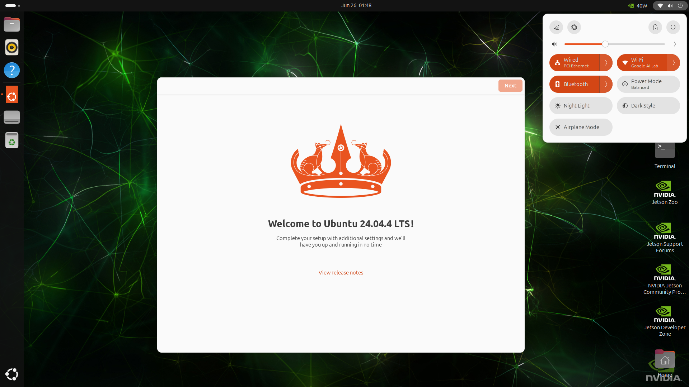
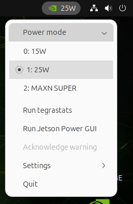

# Unitree G1 JetPack

<p align="center">
  
  <br><sub>JetPack 7.2 (Ubuntu 24.04) on the G1 — WiFi · BT · 40 W MAXN_SUPER all live</sub>
</p>

[](VERSION)
[](#supported-jetpacks)
[](versions/5.1.6/)
[](versions/6.2.2/)
[](versions/7.2/)

> [!IMPORTANT]
> **This is the Unitree G1 EDU JetPack branch (`g1`).**
> Looking for the **Unitree Go2 / R1 EDU JetPack**? Then use the
> **[`go2/r1` branch](https://github.com/legion1581/unitree-jetpack/tree/go2/r1)**.

One script to **build, back up, restore, and flash** a custom NVIDIA **JetPack** image for
the **Unitree G1 custom carrier** (Jetson Orin NX).

## Supported JetPacks

| JetPack | L4T | Kernel | Ubuntu | WiFi | BT | Notes |
|--|--|--|--|:--:|:--:|--|
| [5.1.6](versions/5.1.6/) | 35.6.4 | 5.10.216-tegra | 20.04 | ✅ | ✅ | |
| [6.2.2](versions/6.2.2/) | 36.5.0 | 5.15.185-tegra | 22.04 | ✅ | ✅ | `--super` → **157 TOPS** |
| [7.2](versions/7.2/)     | 39.2.0 | 6.8.12-tegra   | 24.04 | ✅ | ✅ | `--super` → **157 TOPS** |

All tested on hardware. Pick one with `-j <ver>`.

> [!TIP]
> **Super mode (`--super`, JetPack 6.2.2 & 7.2) boosts the Orin NX 16 GB from 100 TOPS to
> [157 TOPS](https://developer.nvidia.com/blog/nvidia-jetpack-6-2-brings-super-mode-to-nvidia-jetson-orin-nano-and-jetson-orin-nx-modules/)** —
> NVIDIA's MAXN_SUPER power mode (GPU up to 1173 MHz, 40 W envelope), no hardware change.
> Verified on the G1 carrier.
>
> ```bash
> ./g1_custom_jetpack.sh -j 7.2 --super flash     # also: -j 6.2.2 --super flash
> ```

<p align="center">
  
  <br><sub><b>MAXN_SUPER + 40 W live on the G1 carrier</b> (nvpmodel tray menu)</sub>
</p>

Stock JetPack doesn't run cleanly on the G1's custom carrier — the USB3 lanes are wired
differently (so recovery RNDIS and the USB host ports don't work out of the box), and the
onboard WiFi/BT needs an out-of-tree driver. This repo wraps NVIDIA's BSP with those carrier
fixes plus a few rootfs tweaks, so a single `-j <ver> flash` gives you a working board.

> Everything is flashed **in place over the USB-C cable** — no need to remove the NVMe
> SSD from the robot. QSPI and the NVMe rootfs are written over the recovery initrd.

Each image applies a few carrier patches to the **device tree** (USB3 wiring, MB2 boot) and
the **rootfs** (login user, static IP, WiFi/BT).

## Requirements

- An **x86_64 Ubuntu host** with `sudo` (the build/flash tooling is NVIDIA's; the rootfs
  steps run aarch64 under `qemu-user-static`, installed automatically if missing).
- The board's USB-C **flashing** port connected to the host. For `flash` / `backup` /
  `restore`, put the board in **recovery (RCM)** mode.

## Quick start

```bash
# choose the JetPack with -j (required for flash). Example: 5.1.6
JP=5.1.6

# board in RECOVERY (RCM) with the USB-C flashing cable connected:
./g1_custom_jetpack.sh status            # confirm APX (bootROM recovery)
./g1_custom_jetpack.sh -j $JP flash all  # full flash (QSPI + NVMe rootfs)
```

`flash` (and `backup` / `restore`) **auto-build the BSP** for the chosen version if
it isn't built yet — no separate `init` step needed. Run `init` on its own only when
you want to (re)build the BSP without flashing.

After it boots: user **`unitree` / `123`**, hostname **`ubuntu`**, wired IP
**`192.168.123.164`** (on `eth0`), WiFi + BT up.

> `-j` can also be given as the `G1_JP` environment variable
> (e.g. `G1_JP=5.1.6 ./g1_custom_jetpack.sh init`).

## Recovery mode (RCM)

`flash`, `backup`, and `restore` need the NX module in **bootROM recovery (APX)**. The
easiest way, if the board is booted, is over SSH — no buttons:

```bash
sudo reboot --force forced-recovery
```

Then `./g1_custom_jetpack.sh status` should show **APX — bootROM recovery (ready)**.
Button methods and the board photo: **[docs/recovery-mode.md](docs/recovery-mode.md)**.

## Tips

Hardware notes — **[docs/tips.md](docs/tips.md)**: which head port carries **DisplayPort**
(port [9], to drive a monitor / bring up the UI) and the **serial console** UART header
(115200 8N1, 1.8 V).

**WiFi** — **[docs/wifi.md](docs/wifi.md)**: connect as a client (STA) or host an access
point (AP) with `nmcli`, set up over SSH on first boot via the wired static IP.

**USB3 mapping** — **[docs/usb-mapping.md](docs/usb-mapping.md)**: how the carrier-patched
DTB rewires the USB3 lanes (XUDC → `usb3-0`, enable `usb3-2`) so recovery RNDIS and the host
ports work, and where it lives in the device tree.

## Commands

**`init` and `flash` require `-j <ver>`.** `backup`/`restore`/`status` are device operations
and **take no version**. `clean` takes `-j` optionally.

```
-j, --jetpack <ver>     which JetPack to act on (7.2 | 6.2.2 | 5.1.6) — required for init/flash
init                    download + extract + patch a flash-ready BSP (into bsp/<ver>)
flash [all|qspi]        flash the chosen JetPack; auto-runs init, rebuilds if assets changed
                          all = QSPI + NVMe rootfs (default); qspi = bootloader only
backup  [name|dir]      dump every partition over the initrd; auto-runs init
restore [name|dir]      restore a dump over the initrd; auto-runs init
status                  show recovery state (APX bootROM / RNDIS initrd) — version-independent
clean [all|bsp|backup]  with -j: that version's BSP; without: all BSPs. backup = ALL dumps
                          (kept: downloads/)
```

```bash
./g1_custom_jetpack.sh -j 5.1.6 flash all     # flash 5.1.6 (builds the BSP first if needed)
./g1_custom_jetpack.sh -j 7.2 --super flash   # flash 7.2 in Super mode (MAXN_SUPER + 40W)
./g1_custom_jetpack.sh backup                 # no -j needed
```

options: `--yes` skips the confirmation prompt on destructive operations. `--super`
(JetPack 6.2.2 / 7.2) flashes NVIDIA's Super board config — it enables the **MAXN_SUPER** power
mode and a **40 W** mode, but draws much more power, so confirm the G1 carrier's rail
and cooling can handle it before using it in the robot. Most operations need `sudo`;
the script elevates the privileged steps itself.

> **Editing a version?** `flash` auto-rebuilds the BSP when anything under
> `versions/<ver>/` is newer than the last build, so a changed patch/asset is never
> flashed from a stale BSP. (`backup`/`restore` reuse any built BSP as-is.)

### Backups

`backup` writes a timestamped folder under `backups/`, renamed on success to encode
the JetPack + L4T it was taken with:

```bash
./g1_custom_jetpack.sh backup                 # -> backups/20260625-141233_jp6.2.2_l4t36.5.0/
./g1_custom_jetpack.sh backup my-snapshot     # -> backups/my-snapshot/   (explicit name)
```

`restore` with **no argument** scans `backups/` and, if there's more than one, shows a
menu to pick from. You can also pass a backup **name** (under `backups/`) or a **full path**:

```bash
./g1_custom_jetpack.sh restore                                    # pick from a menu
./g1_custom_jetpack.sh restore 20260625-141233_jp6.2.2_l4t36.5.0  # by name
./g1_custom_jetpack.sh restore /mnt/usb/some-dump                 # by path
```

`backup`/`restore` borrow a recovery initrd from **any already-built BSP** (or build the
newest version if none exists) — they operate on whatever is on the device, so one BSP
serves every version. No version needs to be specified.

## Repo layout

```
g1_custom_jetpack.sh        the one script (version-aware; -j selects the JetPack)
versions/<ver>/
  version.env               version knobs — URLs, board conf, kernel version, user/IP
  patches/*.sh              every BSP + rootfs change, named, sourced in order
  dtb/                      carrier-patched kernel DTB        -> kernel/dtb + bootloader
  firmware/                 rtl8852bu_fw{,.bin}, _config{,.bin} -> /lib/firmware/
  modules/                  8852bu.ko (WiFi), rtk_btusb.ko (BT) -> /lib/modules/<KVER>/updates/
  overlay/                  rootfs overlay copied onto /  (modprobe.d: 8852bu opts + blacklist)
misc/                       RTL8852BU WiFi/BT driver sources (shared)
  deb/                      DKMS source packages (8852bu, rtk_btusb)
  5.1.6-6.2.2/              plain sources that build as-is on kernels <= ~6.3
  7.2/                      WiFi source patched for kernel 6.8 (+ the diff)
downloads/<ver>/            cached NVIDIA tarballs            (git-ignored)
bsp/<ver>/Linux_for_Tegra   extracted + patched BSP           (git-ignored)
backups/<ts>_jp<ver>_l4t<ver>/   partition dumps (timestamped + tagged)  (git-ignored)
```

## Acknowledgements

A big thank you to RoboLegion community! Visit us at [RoboLegion](https://robolegion.com) for more information and support.

## Support

If you like this project, please consider buying me a coffee:

<a href="https://www.buymeacoffee.com/legion1581" target="_blank"></a>
