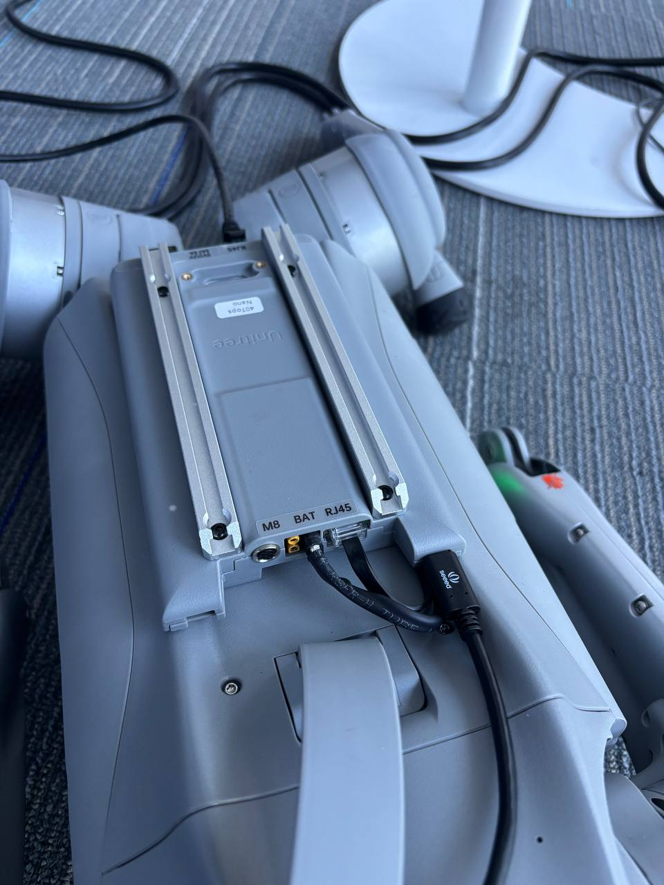
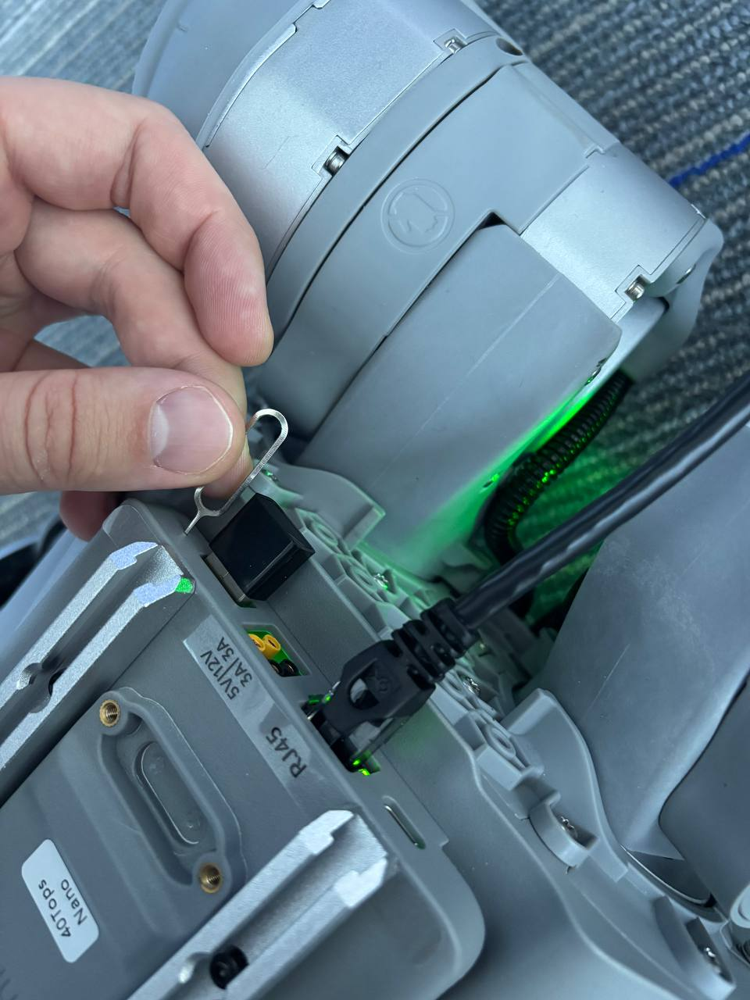

# Recovery mode (RCM)

`flash`, `backup`, and `restore` need the Jetson module in **bootROM recovery (APX)**. Use
either method below, connect the **USB-C flashing cable** from the **top of the Jetson** to
the host, then confirm:

```bash
./go2_custom_jetpack.sh status     # -> APX — bootROM recovery (ready)
```

## Method 1 — software (no buttons, easiest)

If the board is already booted and reachable, tell it to reboot straight into recovery —
locally or over SSH:

```bash
sudo reboot --force forced-recovery
```

It drops into APX with no disassembly or button timing needed. The USB-C flashing cable must
be connected so the host sees the APX device.

## Method 2 — recovery button + power cycle

The Go2 dock has no software-accessible PWR/REC buttons exposed; you trigger recovery by
power-cycling the carrier while holding its recovery button:



> The carrier ports, **left → right: `M8`, `BAT` (yellow power connector), `RJ45`**. The
> USB-C **flashing cable** plugs in next to them.

1. **Connect the USB-C cable** from the top of the Jetson to your PC.
   *(If the USB-C port is hard to reach, loosen the four Jetson carrier-board screws slightly
   and remove the screws holding the mounting strap to improve access.)*
2. **Disconnect the BAT power connector** (XT30/XT60) from the **`BAT`** port on the Jetson
   carrier board — this cuts power to the Jetson module.
3. **Insert a pin** (paperclip or SIM-eject tool) into the **recovery button** hole and
   **press and hold** it.
4. **While holding the button, reconnect the BAT power connector** to the `BAT` port.
5. **Keep holding for ~2 seconds**, then release.
6. **Confirm** on the host with `./go2_custom_jetpack.sh status` → **APX**.



> Step 3–5: a pin in the **recovery button** hole (next to the `RJ45` / `5V/12V` label)
> while you reconnect `BAT` and hold ~2 s.
