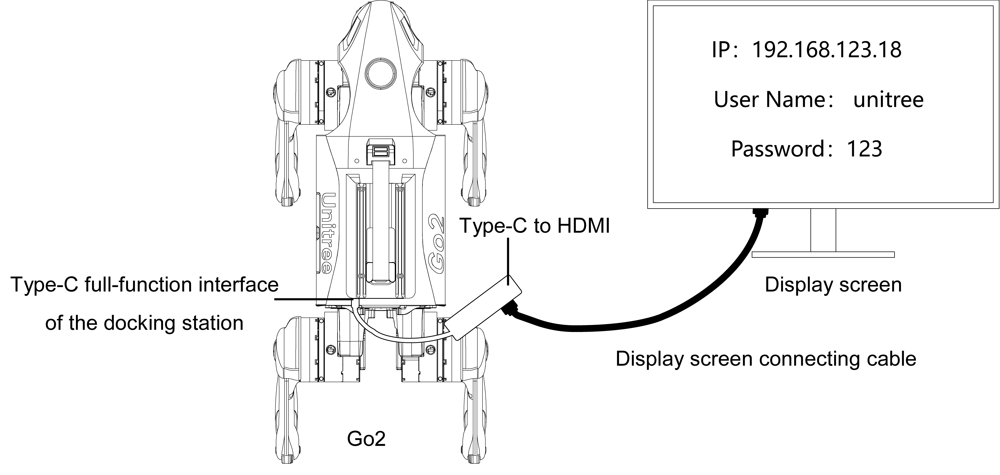

# Tips

Hardware notes for working with the Jetson (Orin NX / Orin Nano) on the Unitree Go2 dock.

## Display output — DisplayPort over the Type-C

The Go2 dock's **DP Type-C** connector carries the Jetson's **DisplayPort** lines, so it's
the one to use to drive a monitor and bring up the desktop UI: plug a **USB-C → DP/HDMI**
adapter into it, connect a screen, and you get the Jetson's graphical output (login /
desktop) directly — handy for first-boot setup or debugging without SSH.

> That **DP Type-C** is **USB 2.0 only** for data — its four high-speed pairs carry
> DisplayPort, not USB3. For **USB 3.x** use the **USB-A** or the **recovery Type-C** (which
> becomes a USB3 host at runtime — see **[usb-mapping.md](usb-mapping.md)**).
