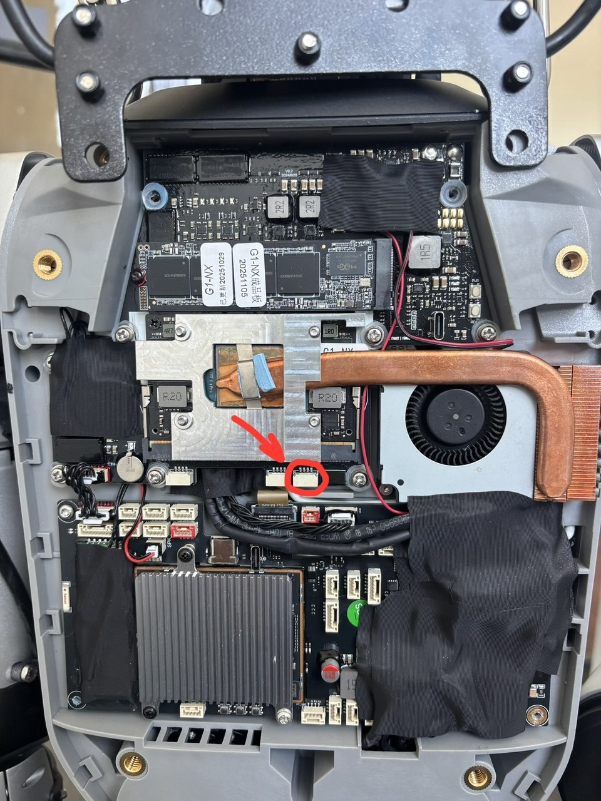

# Tips

Hardware notes for working with the Jetson Orin NX inside the Unitree G1.

## Display output — port [9] has DisplayPort (bring up the UI)

The G1 head exposes several connectors. **Port [9]** (top-left USB-C) carries the Jetson's
**DisplayPort** lines, so it's the one to use to drive a monitor and bring up the desktop UI:
plug a **USB-C → DP/HDMI** adapter into [9], connect a screen, and you get the Jetson's
graphical output (login / desktop) directly — handy for first-boot setup or debugging
without SSH.

![G1 head ports — [9] is the USB-C with DisplayPort lines](g1-nx-ports-dp.jpg)

## Serial console — UART header (115200 8N1, 1.8 V)

For low-level boot logs (UEFI/CBoot, kernel, recovery) the NX carrier has a 4-pin **UART
debug header** next to the module (red arrow below). Pinout, **left → right**:

| pin | signal |
|--|--|
| 1 | **NC** (not connected) |
| 2 | **TX** (board → host) |
| 3 | **RX** (host → board) |
| 4 | **GND** |

- **115200 baud, 8N1**, no flow control.
- **1.8 V logic level** — use a **1.8 V** USB-TTL adapter. A 3.3 V or 5 V adapter can
  damage the SoC; don't use one.
- Wiring (crossed): adapter **RX ← board TX (pin 2)**, adapter **TX → board RX (pin 3)**,
  **GND → GND (pin 4)**. Leave pin 1 (NC) unconnected.
- Then on the host, e.g.: `sudo screen /dev/ttyUSB0 115200`  (or `minicom`, `picocom`).
