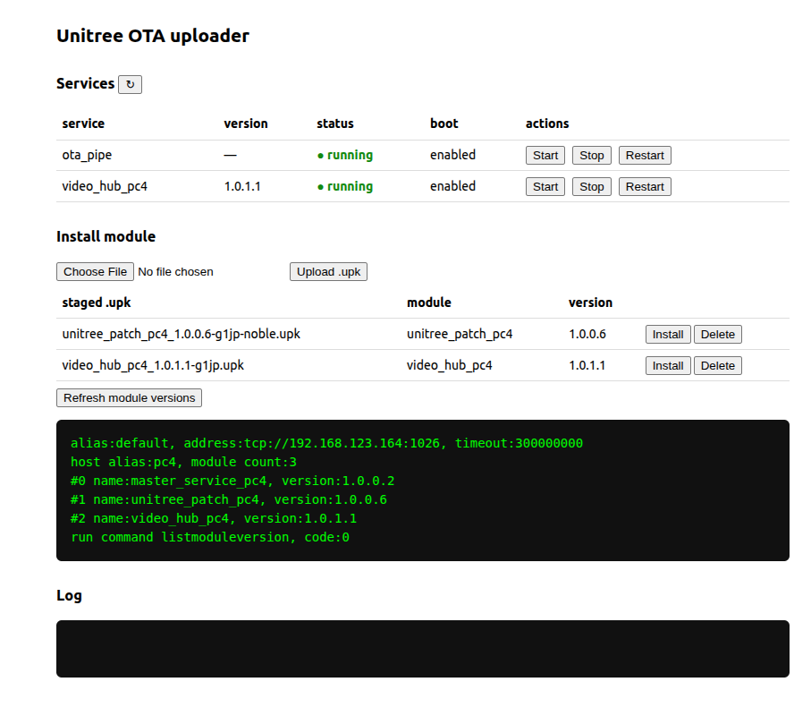

# The Unitree PC4 stack

These images boot the **Unitree PC4 service stack out of the box** — the same
`master_service` supervisor and per-module OTA pipe a G1 EDU carrier runs — plus a small
built-in web UI for installing the robot modules (camera, patches) after flashing.

This page explains what runs after a flash and the two post-install steps to get the
**camera stream** up.

---

## What the image ships

Baked into the rootfs and started automatically on first boot:

| component | what it does |
|--|--|
| **`master_service`** | the service supervisor — starts, monitors and restarts the Unitree services (via `mscli`) |
| **`ota_pipe`** | the on-device OTA pipe — installs / updates / rolls back individual modules (via `ota_pipe_cli`) |
| **`unitree_patch` 1.0.0.2** | the base patch (runtime libs, service config, time-sync setup) |
| **OTA uploader** (`:8888`) | a small web UI to upload a module package and install it, and to start/stop/restart services |

Runtime dependencies the stack needs are already present in the image: the OpenSSL 1.1
libraries, the CycloneDDS runtime (`libddsc`), and the NVIDIA L4T hardware GStreamer
plugins. On boot you get:

- user **`unitree` / `123`**, wired IP **`192.168.123.164`** on `eth0`
- `master_service` + `ota_pipe` **active**
- the uploader reachable at **`http://192.168.123.164:8888/`**

> The two robot modules — the latest `unitree_patch` and `video_hub` (camera) — are **not**
> baked in; you install them once after flashing, using the uploader below. Download the
> module packages for your JetPack version from wherever they're published for you (they're
> distributed as `.upk` files, e.g. `unitree_patch_pc4_1.0.0.6-*.upk` and
> `video_hub_pc4_1.0.1.1-*.upk`).

---

## The OTA uploader

Browse to **`http://192.168.123.164:8888/`** from a machine on the same wired network.



- **Services** — every service `master_service` manages, with its installed version, run
  state, and boot-enable, plus **Start / Stop / Restart** buttons. Auto-refreshes.
- **Install module** — pick a `.upk`, **Upload**, then **Install**. The module name and
  version are read from the package itself, and you get a clear ✅ / ⚠️ / ❌ result with the
  install log.
- **Refresh module versions** — shows what's currently installed.

Installing a package runs its install steps as root on the device, so only expose the
uploader on a trusted network.

---

## Post-install steps

Do these once after flashing (the modules persist across reboots).

### 1. Install the `unitree_patch` module

Upload `unitree_patch_pc4_<version>.upk` and click **Install**. This updates the base patch
and configures **chrony** time synchronisation (the robot's clock syncs to the main
computer). Takes ~10–15 s; you'll see `chrony` become active in the Services panel.

### 2. Install the `video_hub` module (camera)

Upload `video_hub_pc4_<version>.upk` and click **Install**. This installs the camera
streaming service.

The camera needs a moment to warm up on a fresh power-up, so the service waits for the
camera to deliver a stable stream before it starts publishing — **the video comes up on its
own within ~30–60 s of install, with no manual step.** You can watch `video_hub_pc4` turn
`running` in the Services panel; then the stream is available to the robot app.

That's it — after these two installs the stack is complete and everything comes back
automatically on every reboot.

---

## Troubleshooting

**Camera stream doesn't appear after a minute.**
Open the Services panel and check `video_hub_pc4`:
- If it's **stopped**, click **Start**.
- If it's **running** but there's still no picture, click **Restart**, or reboot the board.
The camera-warmup handling makes this rare, but a restart always clears it.

**A module didn't install (⚠️ or ❌).**
The result line shows the OTA code and log. ⚠️ usually means the package installed but the
service didn't start (check the Services panel and Start it); ❌ means the install itself
failed (re-upload and retry).

**Check services from a shell instead of the UI.**

```bash
/unitree/sbin/mscli listservice          # services + state
/unitree/sbin/ota_pipe_cli -a default -c listmoduleversion   # installed module versions
```
